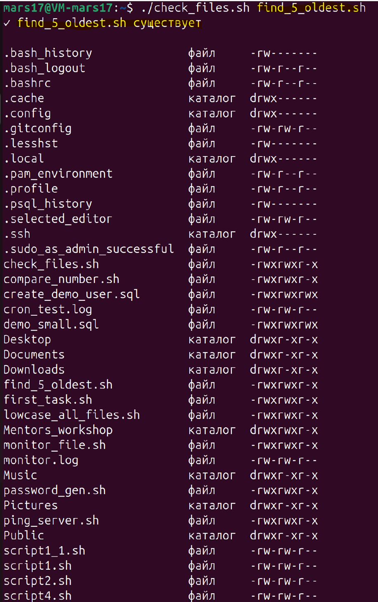
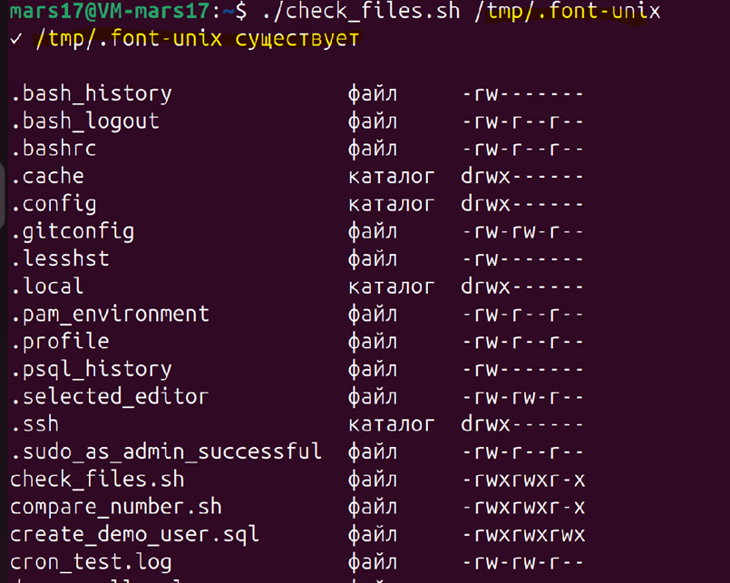
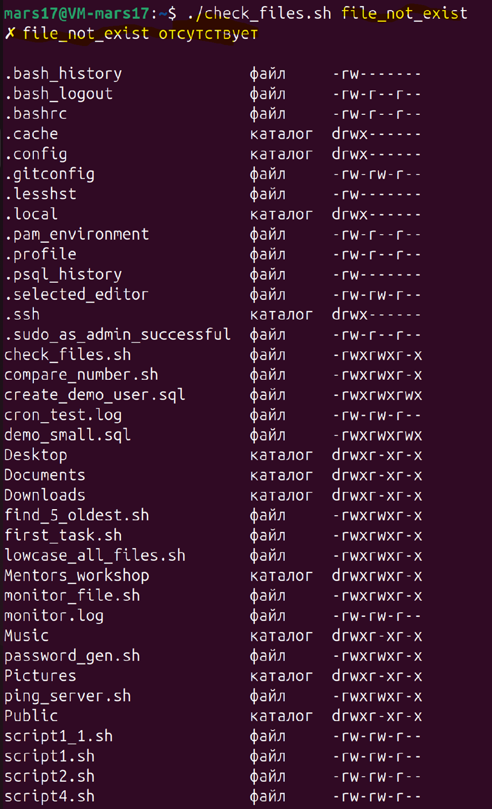
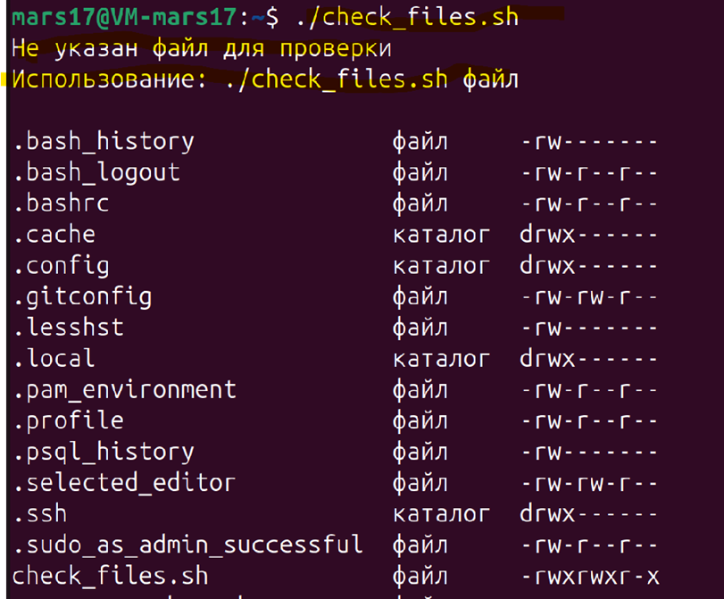

#### **Задача 1**

**Функционал Bash**

Напишите `Bash`-скрипт, который выполняет следующие действия:
1. Создаёт список всех файлов в текущей директории, указывая их тип (файл, каталог
и т.д.).
2. Проверяет наличие определённого файла, переданного как аргумент скрипта, и
выводит сообщение о его наличии или отсутствии.
3. Использует цикл `for` для вывода информации о каждом файле: его имя и права
доступа.

Скрипт в приложенном файле - ``task_1.sh``

Результат выполнения программы (скриншоты) 

