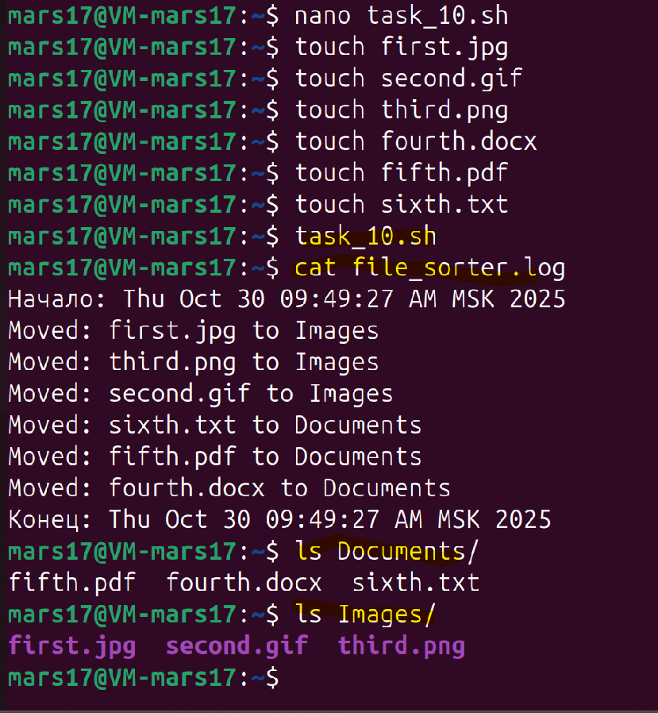
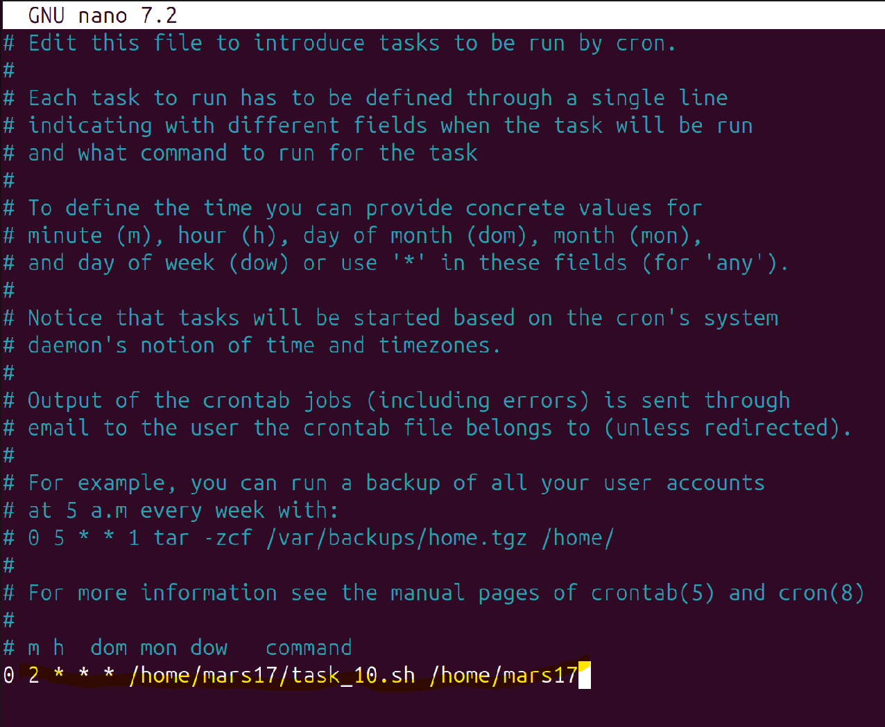

#### **Задача 10**

**Автоматическая сортировка файлов:**

Напишите скрипт, который автоматически сортирует файлы в указанной директории:
- Файлы с расширениями `.jpg`, `.png` и `.gif` перемещает в папку `Images`.
- Документы `(.txt, .pdf, .docx)` — в папку `Documents`.
- Скрипт должен запускаться автоматически через cron каждую ночь и вести лог всех перемещений.

Скрипт в приложенном файле - ``task_10.sh``

Пример выполнения скрипта



Добавление скрипта в `crontab`

```bash
# Открыть crontab
crontab -e

# Добавить строку (запуск каждый день в 2:00 ночи)
0 2 * * * /home/mars17/task_10.sh /home/mars17
```

