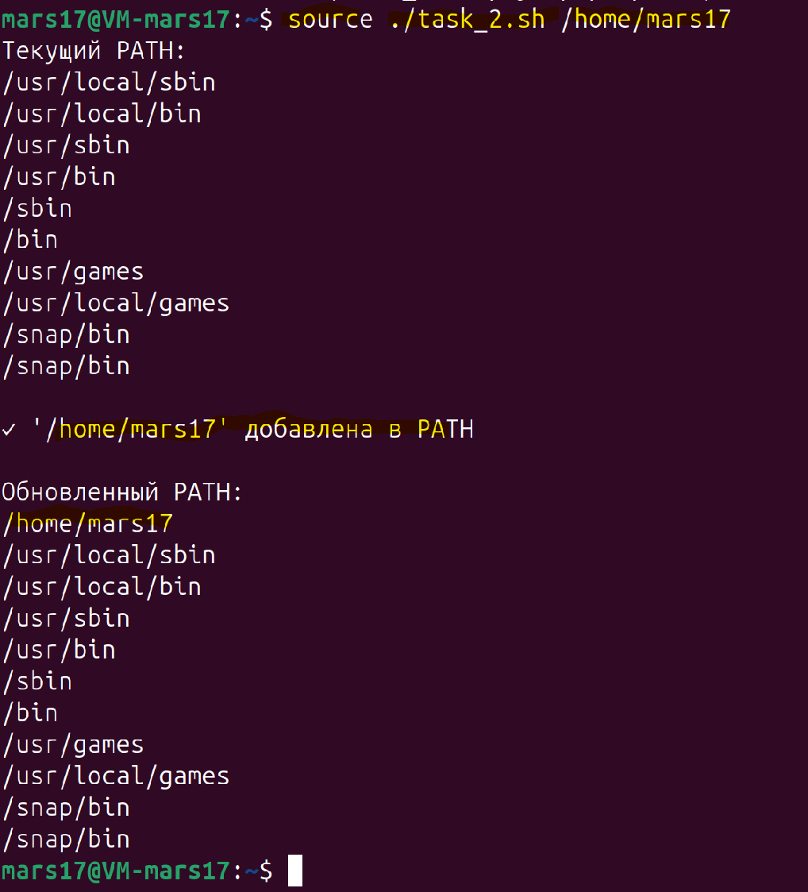
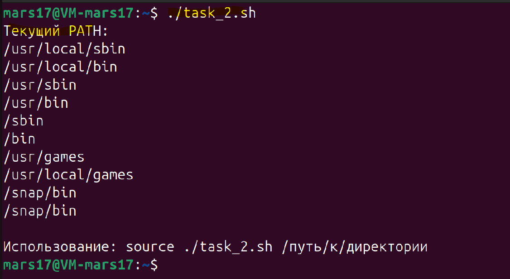
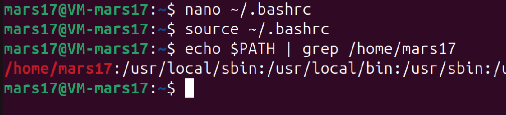

#### **Задача 2**

**Переменная PATH**:

1.     Напишите скрипт, который выводит текущее значение переменной `PATH` и добавляет в неё новую директорию, переданную в качестве аргумента.

2.     Объясните, почему изменения переменной `PATH`, сделанные через терминал, временные, и предложите способ сделать их постоянными. Добавьте команду в файл `.bashrc` и продемонстрируйте, как перезапустить терминал для применения изменений.

Скрипт в приложенном файле - ``task_2.sh``

Пример выполнения скрипта
Если скрипт выполнить без команды `source` то изменения `PATH` произойдут только в дочернем процессе скрипта, но не в родительском `shell` (в терминале)

Поэтому выполнение скрипта начиснаем с команды `source`



При этом в другом терминале `PATH` не будет содержать изменений



Это происходит потому что, 
- Переменные окружения хранятся в **оперативной памяти** процесса `shell`
- Каждый новый терминал = **новый процесс** = чистая копия переменных
- Изменения не записываются в постоянное хранилище

**Способ сделать изменения постоянными:**

```bash
# Открываем файл .bashrc для редактирования
nano ~/.bashrc

# Добавляем в конец файла:
if [[ ":$PATH:" != *":/home/mars17"* ]]; then
    export PATH="/home/mars17:$PATH"
fi
```

```bash
# После редактирования .bashrc:

# Способ 1: Перезапустить терминал полностью
# Закрыть и открыть новый терминал

# Способ 2: Выполнить команду в текущем терминале
source ~/.bashrc

# Проверяем что директория добавилась:
echo $PATH | grep /home/mars17
```


