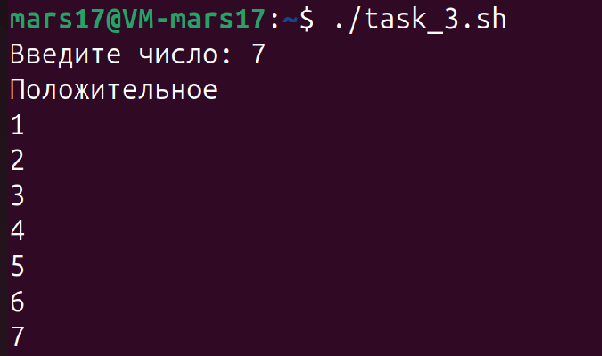
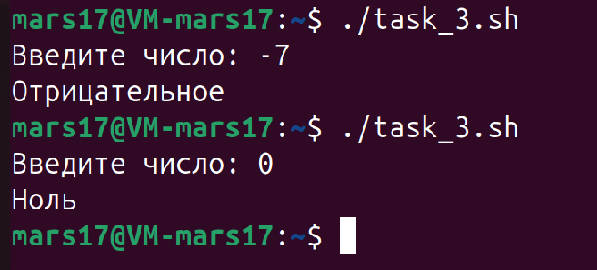
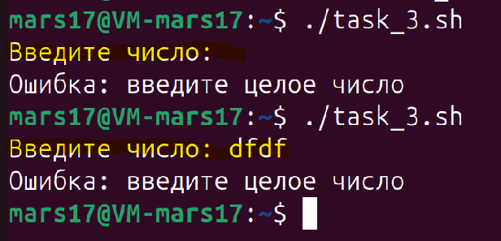

#### **Задача 3**

**Управляющие конструкции (условия и циклы):**

Задание: Напишите скрипт, который запрашивает у пользователя ввод числа и затем:
- Использует `if`, чтобы проверить, является ли число положительным, отрицательным или нулем, и выводит соответствующее сообщение.
- Использует `while` для подсчёта от `1` до введенного числа (если оно положительное).

Скрипт в приложенном файле - ``task_3.sh``

