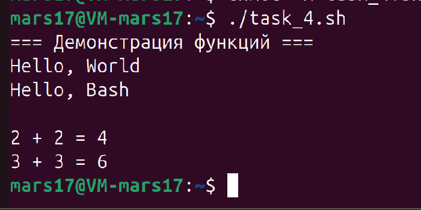

#### **Задача 4**

**Работа с функциями:**

Задание: Создайте скрипт с функцией, которая принимает в качестве аргумента строку и выводит её с префиксом `"Hello, "`. 
Напишите ещё одну функцию, которая принимает два числа и возвращает их сумму. 
Вызовите обе функции в скрипте и продемонстрируйте результат.

Скрипт в приложенном файле - ``task_4.sh``

