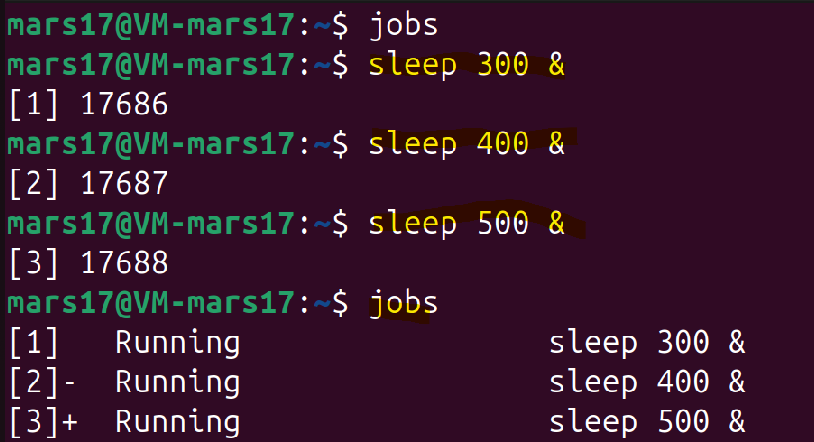
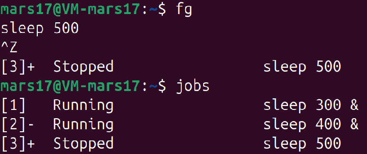
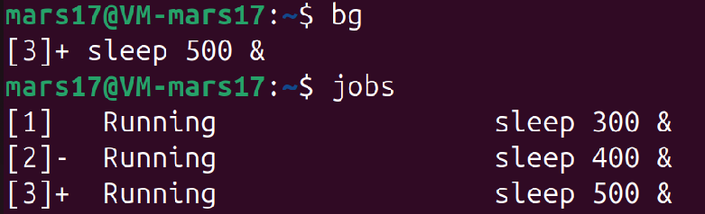
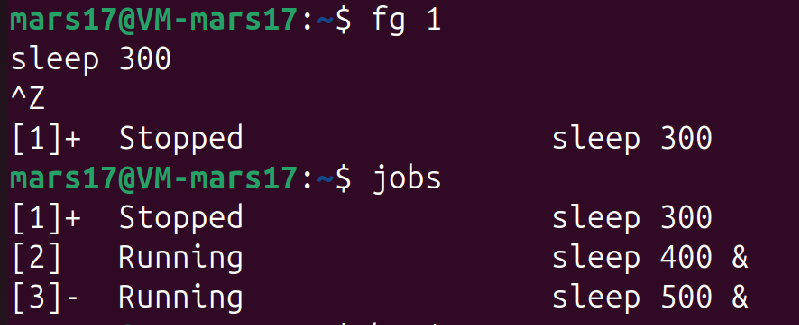
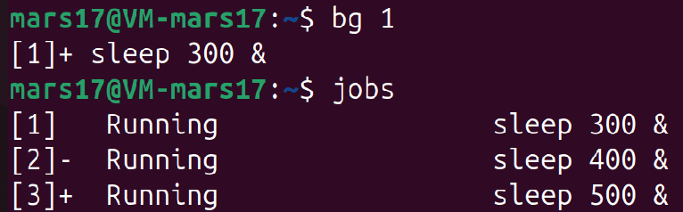
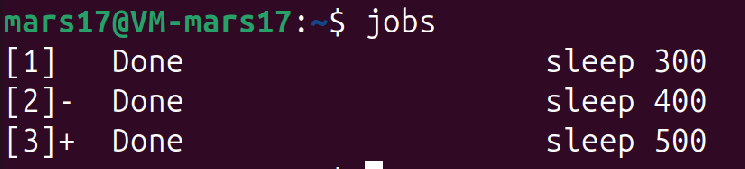

#### **Задача 5**

**Управление процессами и фоновое выполнение:**

Задание: Напишите скрипт, который запускает три команды `sleep` с разными временами в фоновом режиме. 
Используйте команды `jobs, fg, bg`, чтобы продемонстрировать управление этими задачами. 
Опишите, что вы наблюдали.

К данной задаче нет скрипта. Задание выполнено в терминале. 

**Описание выполнения задания**

Запускаем в терминале 3 команды `sleep` в фоновом режиме с разным временем выполнения.
Проверяем их запуск командой `jobs`

Каждая задача получила номер: `[1], [2], [3]`

`+` - следующая задача для команд fg/bg по умолчанию

`-` - предыдущая задача

Все в состоянии `Running`

Вызываем команду `fg` для перевода задачи по умолчанию в `foreground` (передний план)

`fg` переводит задачу `3` на передней план

Останавливаем выполнение задачи `3` с помощью `ctrl - Z`. Задача переходит в состояние - остановлена `Stopped`.

Вызываем команду `bg` для перевода задачи по умолчанию в `background` (фоновый режим)

`bg` переводит задачу `3` в выпонение в фоновом режиме.

Вызываем команду `fg 1` для перевода задачи `1` в `foreground`

Останавливаем выполнение задачи `1` с помощью `ctrl - Z`. Задача переходит в состояние - остановлена `Stopped`.

Вызываем команду `bg 1` для перевода задачи `1` в `background` 
Задача продолжает выполнение в фоновом режиме.

Проверяем что все задачи выполнены.

В задании можно было наблюдать
- Параллельное выполнение - все `sleep` работают одновременно

- Управление состоянием - задачи можно переключать между `foreground/background`

- Автоматическое завершение - задачи исчезают из `jobs` при завершении

- Интерактивность - можно динамически управлять процессами