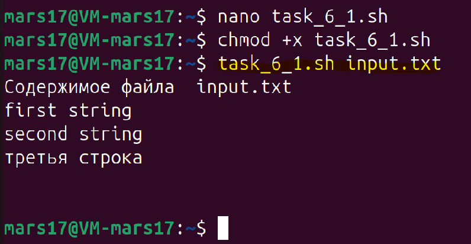
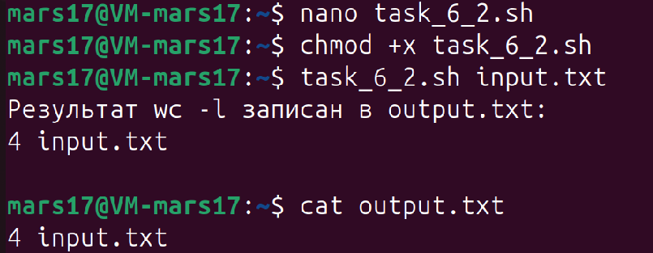
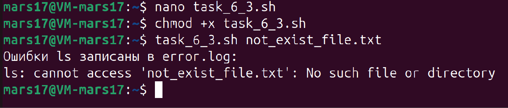

#### **Задача 6**

**Ввод/вывод и перенаправление:**

Задание: Создайте скрипт, который выполняет следующие действия:
1.	Читает данные из файла `input.txt`.
2.	Перенаправляет вывод команды `wc -l` (подсчет строк) в файл `output.txt`.
3.	Перенаправляет ошибки выполнения команды `ls` для несуществующего файла в файл `error.log`.

---
Выполняем чтение с помощью команды `cat input.txt`

Скрипт в файле - `task_6_1.sh`

---

Выполняем перенаправление вывода с помощью команды `wc -l input.txt > output.txt`

Скрипт в файле - `task_6_2.sh`

---

Выполняем перенаправление ошибок с помощью команды `ls not_exist_file 2> error.log`

Скрипт в файле - `task_6_3.sh`

