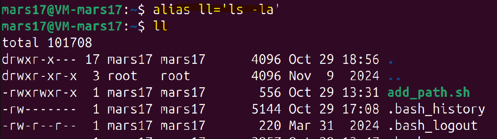
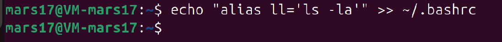
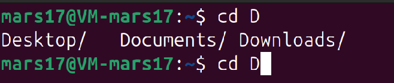

#### **Задача 7**

**Использование alias и автодополнение:**

Задание: 
- Создайте `alias` для команды `ls -la` и назовите его `ll`. Напишите команду, чтобы сделать `alias` постоянным, и объясните, где она должна быть добавлена. 
- Продемонстрируйте использование автодополнения на примере команды `cd`.

Файлов со скриптами к данной задаче нет.

---

Создадим временный `alias` который действует до закрытия терминала

Что бы сделать `alias` постоянным добавим его в `~/.bashrs`

`~/.bashrc` - для текущего пользователя (рекомендуется)

`~/.bash_profile` - для login shell

`/etc/bash.bashrc` - для всех пользователей системы

---

Автодополнение выполняется при нажатии клавишы `Tab`

В данном случае, предложены варианты продолжения названия каталога в текущем каталоге начинающиеся на букву `D`

