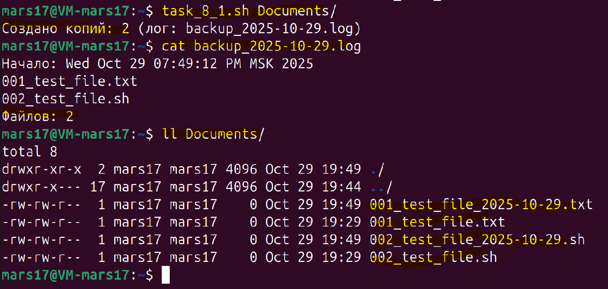

#### **Задача 8**

**Менеджер резервного копирования:**

Создайте скрипт, который:
- Создаёт резервную копию всех файлов в указанной директории, добавляя к именам файлов текущую дату.
- Поддерживает сохранение логов операций в отдельный файл и уведомляет пользователя об успешном завершении с указанием количества файлов.

Скрипт в приложенном файле - ``task_8.sh``

