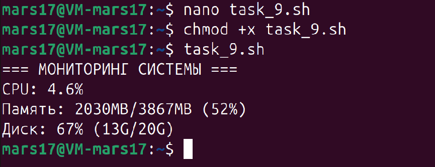
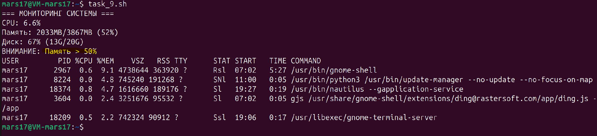

#### **Задача 9**

**Мониторинг системы:**
Напишите скрипт для мониторинга ресурсов системы:
- Сбор данных о загрузке процессора, использовании памяти и дискового пространства.
- Уведомление пользователя, если использование памяти превышает 80%, с выводом текущих процессов, потребляющих наибольшее количество ресурсов.

Скрипт в приложенном файле - ``task_9.sh``

Изменил значение на `50%` что бы отобразить вывод из скрипта

